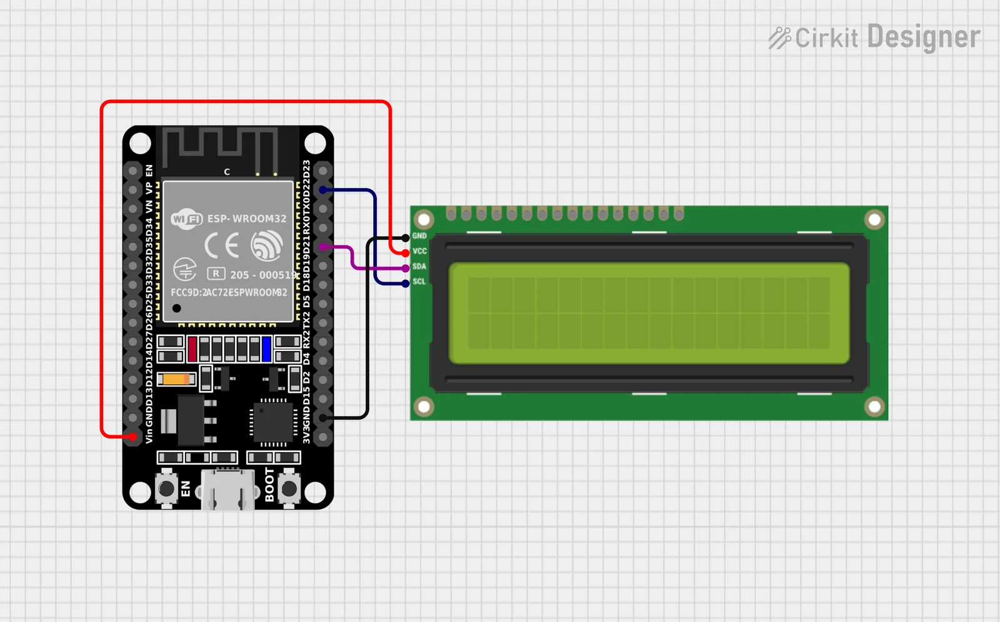
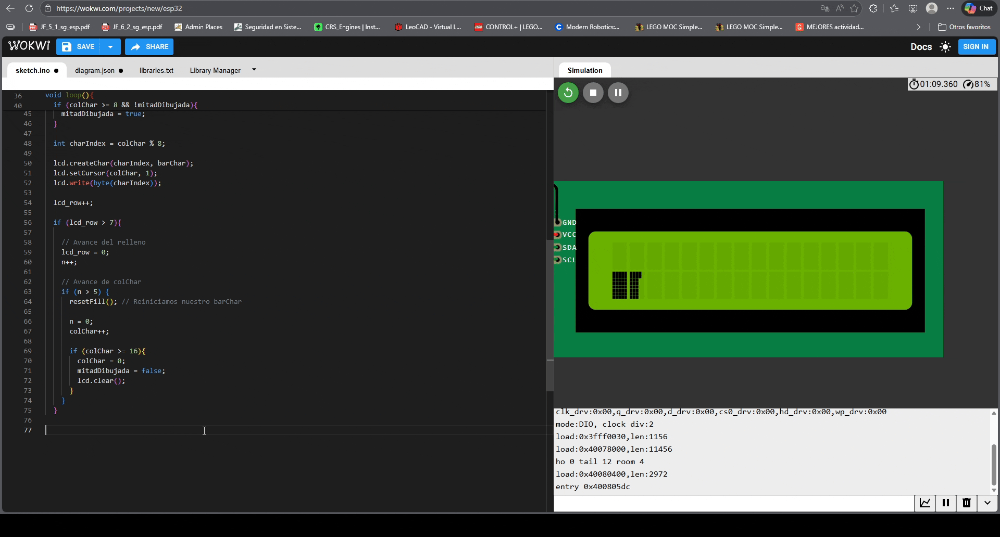

<div align="center">
  <h1><strong> TIMER ESP32 </strong></h1>
  <p><i>Fragmento de otro proyecto, cuyo propósito es tener un cronómetro interactivo y con una barra de progreso básica para una pantalla LCD 16x2 I2C</i></p>
  <sub><small>Versión: 0.1</small></sub>
</div>

---  

## Propósito

Un proyecto simple y sencillo donde la persona pueda seleccionar el tiempo y la barra de carga se va llenando dependiendo de eso. Por ahora y en la versión 0.1 solo se ha implementado la animación de la barra

## Hardware

| Componente | Especificaciones |
|------------|------------------|
| Microcontrolador | ESP32 (usado, mas no necesario)|
| Display | LCD 16x2 con módulo I2C |
| Comunicación | I2C (SDA, SCL) |

## Diagrama de Conexiones




### Lógica de Animación (actualizado a la versión)

1. Se crean caracteres custom de 5x8 píxeles
2. Cada carácter se rellena fila por fila (8 filas)
3. Se avanzan las columnas de izquierda a derecha
4. Al llegar a la columna 8, se dibuja la mitad izquierda completa
5. La animación se reinicia al completar las 16 columnas

## Salida Esperada
```
Pantalla LCD:
[████████        ]  ← Animación progresiva
[                ]
```

